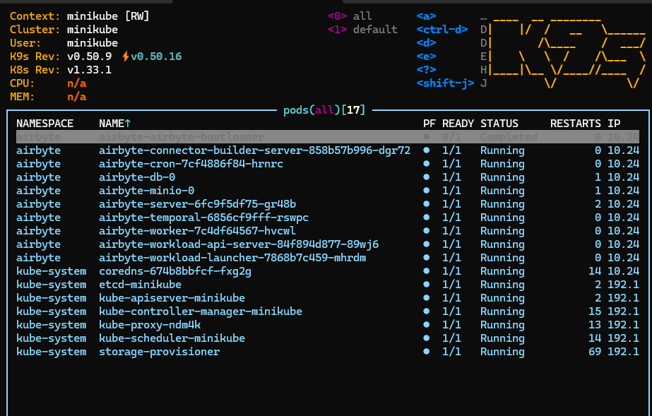
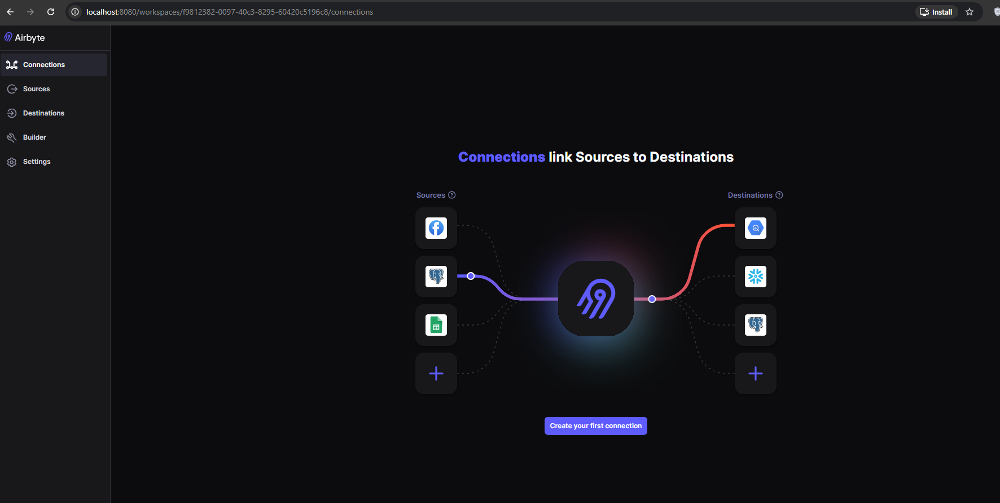

# Weather ETL Pipeline

An **incremental ETL pipeline** for hourly weather forecasts using **Weatherbit API → MongoDB → Airbyte (OSS on Minikube) → DuckDB/MotherDuck**.
This project demonstrates end-to-end data engineering: API ingestion, schema design, staging, incremental sync, and analytics.

---

## Pipeline Overview

1. **Extract:** Fetch hourly forecasts from Weatherbit API.
2. **Transform:** Normalize JSON payloads into a clean schema.
3. **Load (Staging):** Upsert into MongoDB with deterministic `_id`s.
4. **Replicate:** Use Airbyte OSS for incremental sync (Append + Deduped).
5. **Warehouse:** Query-ready tables in DuckDB/MotherDuck.

---

## Tech Stack

* **Python** – API ingestion, normalization, and MongoDB upsert
* **MongoDB** – Staging database with replica set and indexes
* **Airbyte OSS** – Incremental syncs with primary key + cursor
* **DuckDB / MotherDuck** – Analytics warehouse

---

## Prerequisites

* Python 3.10+
* `pip install -r requirements.txt` (includes `requests`, `pymongo`, `python-dotenv`)
* MongoDB (single-node replica set)
* Weatherbit API key
* Airbyte OSS (running on Docker / Minikube)
* MotherDuck account + API token (for DuckDB in the cloud)

---

## 1) Configure MongoDB

Airbyte’s MongoDB source expects a **replica set**, even for a single node.

1. Edit MongoDB config:

```bash
sudo nano /etc/mongod.conf
```

Ensure the following:

```yaml
net:
  bindIp: 0.0.0.0
replication:
  replSetName: rs0
```

2. Restart MongoDB:

```bash
sudo systemctl restart mongod
sudo systemctl status mongod
```

3. Initiate replica set:

```bash
mongosh
rs.initiate({ _id: "rs0", members: [{ _id: 0, host: "127.0.0.1:27017" }] })
rs.status()
```

4. Create project database and user:

```javascript
use weather_pipeline
db.createUser({
  user: "weather_user",
  pwd: "weather123",
  roles: [{ role: "readWrite", db: "weather_pipeline" }]
})
```

5. Optional but recommended: indexes for incremental syncs:

```javascript
db.weather.createIndex({ updatedAt: 1 })
db.weather.createIndex({ city: 1, dt: 1 }, { unique: true })
```

---

## 2) Configure `.env`

Create a `.env` file with:

```dotenv
DB_USERNAME=xxxxxx
DB_PASSWORD=xxxxxx
DB_NAME=xxxxxx
CLUSTER_NAME=xxxxxx
API_KEY = xxxxxx
BASE_URL=https://api.weatherbit.io/v2.0/forecast/hourly?city=London&key=API_KEY
```

---

## 3) Run Python Ingestion

Fetch, normalize, and upsert weather data into MongoDB:

```bash
python ingest_weatherbit.py
```

Expected output:

```
fetched=49, upserted/modified=49
```

---

## 4) Set up Airbyte OSS

Airbyte will replicate MongoDB staging data into DuckDB/MotherDuck.

### Add Source: MongoDB

* Cluster type: Self-managed replica set
* Connection string:

```text
mongodb+srv://<DB_USERNAME>:<DB_PASSWORD>>@<CLUSTER_NAME>.pgktmnv.mongodb.net/<DB_NAME>?retryWrites=true&w=majority
```

* Use `localhost` if Airbyte runs on the same machine; use PC IP if using Minikube.

### Add Destination: MotherDuck

* Paste your MotherDuck API token
* Destination path (database): `md:weather_pipeline_analytics`
* Schema: `main` (or leave default)
* Test & Save

### Create Connection

* Source → Destination (Mongo → MotherDuck)
* Sync mode: Incremental | Append + Deduped
* Cursor field: `updatedAt`
* Primary key: `_id`
* Schedule: Manual for first run → then hourly or as needed

---

## 5) Verify in MotherDuck

Using DuckDB CLI:

```sql
SELECT COUNT(*) FROM main.weather_readings;

SELECT city, dt, temp_c, precip_mm
FROM main.weather_readings
ORDER BY dt DESC
LIMIT 10;
```

---

## 6) Pipeline Diagram

```
   +----------------+       +-----------------+       +----------------+       +------------------+
   | Weatherbit API |  -->  |  MongoDB Staging |  -->  |  Airbyte OSS    |  -->  | DuckDB / MotherDuck |
   +----------------+       +-----------------+       +----------------+       +------------------+
          |                        |                        |                        |
          |  Hourly JSON feeds      |  Upsert raw + clean    |  Incremental sync       | Query-ready tables
          |                        |  data with _id &      |  (Append + Deduped)    | for analytics & dashboards
          |                        |  updatedAt indexes    |                        |
          v                        v                        v                        v

      Extract / Transform       Load (Staging)           Replicate / Sync         Analytics / Dashboards
```

**Notes:**

* Python script handles **extraction and transformation**.
* MongoDB acts as a **staging layer** with indexes for incremental updates.
* Airbyte OSS performs **incremental replication** to DuckDB / MotherDuck.
* DuckDB / MotherDuck stores **query-ready tables** for dashboards and analytics.

---

## 7) GitHub Repository Structure

```
weather_data_pipeline/
├── incremental-weather-etl/                # Main ETL pipeline repository
│   ├── config/                             # Configuration files
│   │   ├── airbyte/                        # Airbyte source/destination configs
│   │   └── env_templates/                  # Template environment files for setup
│   ├── image/                              # Architecture diagrams and pipeline visuals
│   ├── ingest_weatherbit.py                # Python script to ingest weather data from API → MongoDB
│   ├── requirements.txt                    # Python dependencies for the pipeline
│   ├── sql_queries.sql                     # Analytical and validation queries (e.g., DuckDB)
│   ├── .env                                # Environment variables (excluded from version control)
│   └── venv/                               # Local Python virtual environment (not committed)
├── .gitignore                              # Git ignore rules for sensitive files and local environments
└── README.md                               # Project documentation, setup instructions, and usage

```

---

## 8) Key Features

* **Automated hourly ingestion** from Weatherbit API
* **Incremental updates** using `_id` + `updatedAt`
* **Staging and warehouse separation** (MongoDB → DuckDB/MotherDuck)
* **Analytics-ready tables** for dashboards
* **Open-source Airbyte deployment** on Minikube

## System Architecture and Deployment Overview

The screenshots below demonstrate that Airbyte OSS was successfully deployed
on a local Kubernetes cluster using Minikube and that the Airbyte web UI
was accessible for source and destination configuration.

### Airbyte Pods Running on Minikube


### Airbyte UI – Source and Destination Configuration



---
## Pipeline Architecture

The diagram below illustrates the end-to-end weather data pipeline, from API ingestion through staging, replication, and analytics.

 

## 9) Future Enhancements

* Add **alerting** for API or sync failures
* Include **additional weather providers**
* Integrate **real-time dashboard** updates
* Move to **fully managed warehouse** (e.g., Snowflake, BigQuery) for scalability
